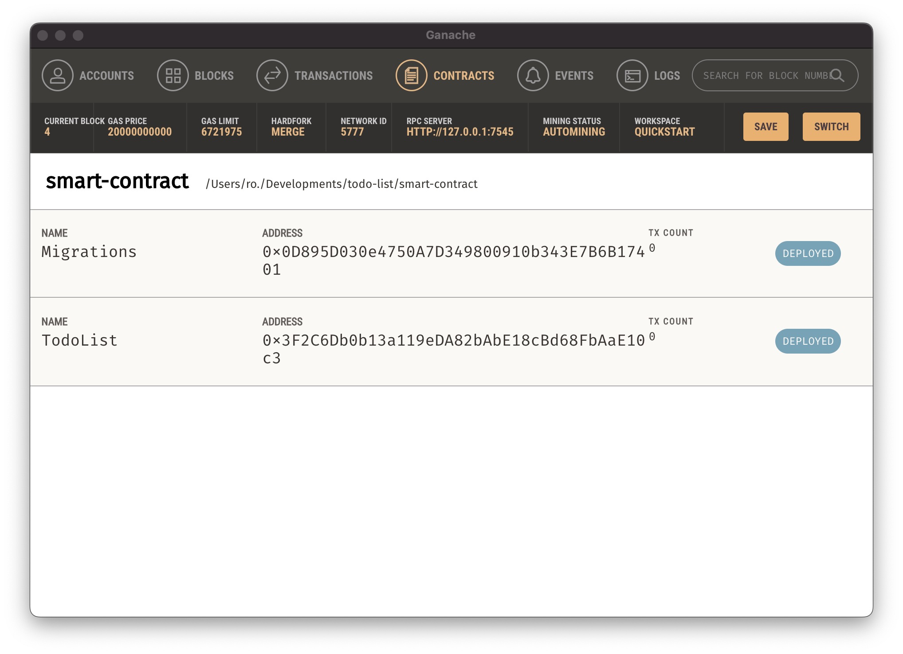

# Todo List

Manage your tasks easily with a to-do list app that utilizes Ethereum smart contracts via [ethers.js](https://docs.ethers.org/v6/)

<br/>

## Projects

<p align="center">
  
</p>

<p align="center">
  <a href="https://todo-list-wine-gamma.vercel.app/">🖥️ Live Demo</a>
</p>

> Smart contracts have been deployed on the Sepolia testnet

<br/>

## Features

- [x] Connect/Disconnect to metamask wallet.
- [x] View all Tasks (Grid / List)
- [x] Add a new todo item.
- [x] Delete a todo item.
- [x] Toggle completion status of todo item.
- [x] Search todo item with title.
- [ ] Edit a todo item.

<br/>

## Get started

Install the Dependency:

```shell
npm i

<br/>
```

## After that you can deploy smart contract locally using [Truffle](https://archive.trufflesuite.com/) and [Ganache](https://archive.trufflesuite.com/ganache/)

Install Truffle and Ganache

```shell
npm i -g truffle
truffle version
```

Once it is done, you can go to [tufflesuite.com/ganache](https://archive.trufflesuite.com/ganache/) to install ganache.

Now that we have Truffle and Ganache installed, we can start deploy a TodoList contract start by change to smart-contracts directory.

```shell
cd smart-contracts
```

<br/>

## Compiling and deploy a smart contract in Truffle

To compile the contracts, we use the command below

```shell
truffle compile
```

And to deploy the contract to Ganache, we use the command

```shell
truffle migrate
```

Make sure Ganache is open and running. As this is our first migration, Truffle will deploy both contracts: *Migrations* and *Storage*.

<p>
  
</p>

If everything went well, we can make sure in Ganache that the contract has been sent to the blockchain.

<p>
  
</p>

On Ganache, select the Contracts tab and link Truffle projects to view useful data such as contracts and stored data

<div style="display: flex;">
  
  
</div>

Here what it shows

<p>
  
</p>

You can get contract address here as it will be use to connect from front-end

<p>
  
</p>

Now that we have deploy and get contract address we can go back from smart-contracts directory and go to libs/constants.ts to set a contract address

```typescript
// constants.ts
import TodoList from "@/smart-contract/build/contracts/TodoList.json";

export const contractAddress = "0x3F2C6Db0b13a119eDA82bAbE18cBd68FbAaE10c3";
export const contractAbi = TodoList.abi;
```

After that we can save and run the project locally

```shell
npm run dev
```

**WE DONE!**

<br/>

## One last thing

We can import an account from Ganache and use it for testing purposes.

<p>
  
</p>
